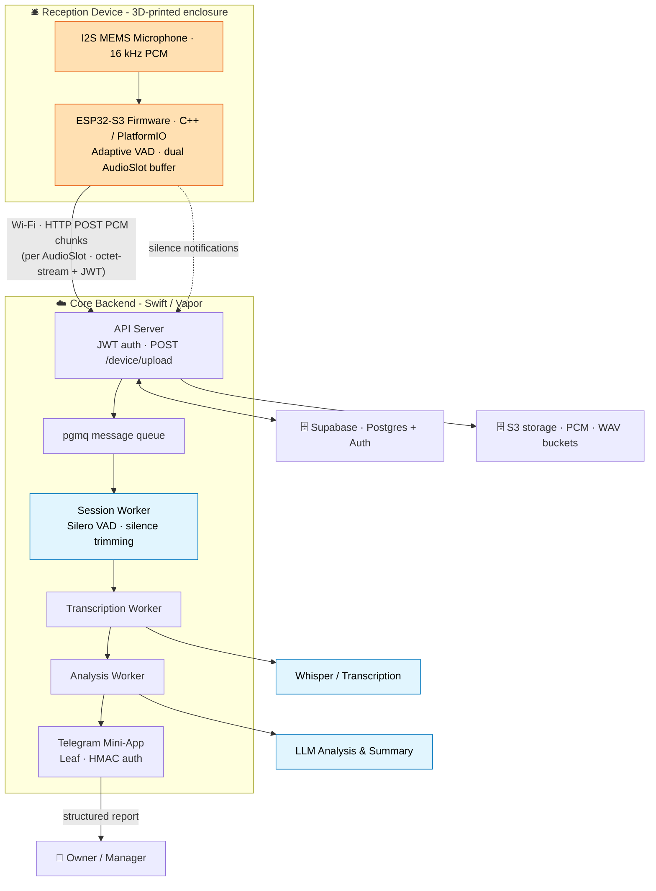
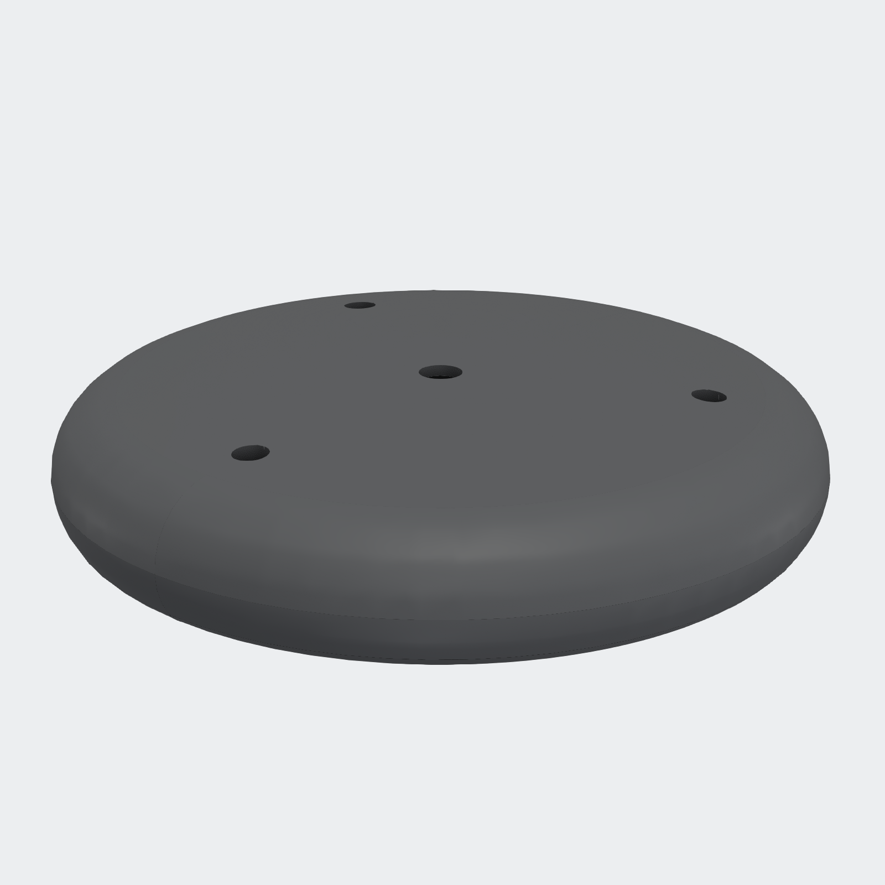
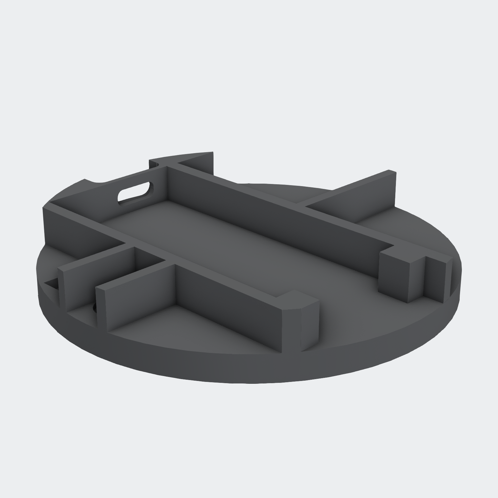
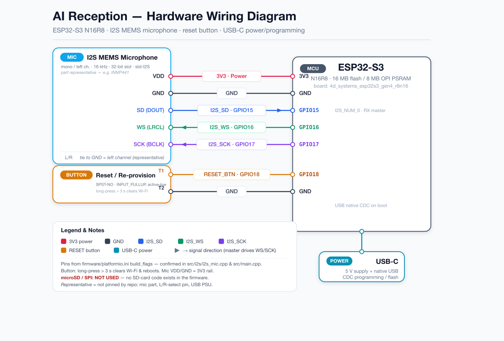

<div align="center">

# 🛎️ AI Reception

**A passive AI receptionist on an ESP32-S3.**
It quietly captures front-desk conversations, transcribes and analyzes them in the cloud, and turns each one into a structured report the manager reviews in a Telegram mini-app.


[Case study](docs/case-study.md) · [Architecture](#-architecture) · [Tech stack](#-tech-stack) · [Hardware](#-hardware--enclosure) · [Build & run](#-build--run) · [Author](#-author)

</div>

<div align="center">

</div>

---

## What it is

**AI Reception** is an end-to-end product: custom **firmware**, a cloud **backend**, and a 3D-printed **enclosure**, built and integrated by one engineer. A small ESP32-S3 device sits on a reception desk with a MEMS microphone. It detects speech on-device, captures audio in short raw-PCM chunks, and uploads them to a Swift/Vapor backend that reconstructs each conversation, transcribes and analyzes it with OpenAI, and presents a clean, structured report to the owner in a Telegram mini-app.

**Why it's interesting**

- 🎙️ **On-device voice activity detection**: the firmware runs an adaptive VAD, so only real speech is buffered and uploaded, never silence.
- 🧩 **Full-stack, multi-discipline**: embedded C++ firmware, a Swift/Vapor microservice backend, a Telegram mini-app, and printable CAD hardware in one coherent system.
- ☁️ **Discrete chunked upload**: fixed-length audio "slots" are POSTed over HTTP and reassembled into sessions server-side, then trimmed with Silero VAD before transcription. No persistent audio stream.
- 🤖 **Cloud AI**: OpenAI Whisper for transcription, an OpenAI LLM for summary and analysis.
- 🛠️ **Real hardware**: a custom 3D-printed round enclosure, shipped as editable CAD source.

---

## 🏗 Architecture



### How it works

1. **Capture.** The ESP32-S3 reads the I2S MEMS microphone at 16 kHz and fills fixed-length **AudioSlot** PCM buffers. An on-device **adaptive VAD** decides what counts as speech.
2. **Upload.** Each completed slot is sent as a discrete **HTTP POST of raw PCM** to `POST /device/upload/{device_id}` (`application/octet-stream`, `Bearer <JWT>`, with `X-Timestamp` / `X-Sample-Rate` / `X-Sample-Count` headers). Gaps are reported via `POST /device/silence`. *The device uploads chunks; it never holds an open audio stream.*
3. **Sessionize.** The Vapor **API Server** stores chunks in S3 and enqueues them on a Postgres `pgmq` queue. The **Session Worker** groups chunks into sessions and trims silence with **Silero VAD**.
4. **Understand.** The **Transcription Worker** runs **OpenAI Whisper**; the **Analysis Worker** runs an **OpenAI LLM** to produce a structured summary.
5. **Deliver.** The owner opens the **Telegram mini-app** to review a clean, structured report of each conversation.

---

## 🧰 Tech stack

| Layer | Technology |
|---|---|
| **Firmware** | ESP32-S3 · C++ · PlatformIO/Arduino · I2S audio · adaptive VAD · Wi-Fi captive portal |
| **Backend** | Swift · Vapor · async/await · JWT auth · `pgmq` queue |
| **AI** | OpenAI Whisper (transcription) · OpenAI LLM (analysis) · Silero VAD (silence trimming) |
| **Data** | Supabase (Postgres + Auth) · S3-compatible object storage |
| **Interface** | Telegram Bot + Mini-App (Leaf, HMAC auth) |
| **Hardware** | 3D-printed round enclosure (Shapr3D → STEP) |
| **Ops** | Docker Compose · nginx · Dozzle |

---

## 📁 Repository structure

```text
ai-reception-case/
├── firmware/      ESP32-S3 device firmware (C++ / PlatformIO)
├── core/          Swift / Vapor backend: API + workers + Telegram mini-app
├── hardware/      3D-printed round enclosure (STEP) + print notes
├── docs/          Case study (English) + screenshots + demo video
└── assets/        CAD renders and diagrams used in this README
```

---

## 🔩 Hardware & enclosure

The device lives in a custom 3D-printed round enclosure. Editable CAD source (`.step`) lives in [`hardware/`](hardware/).

<div align="center">

&nbsp;&nbsp;

<br/>
<sub>The round enclosure (left) and its internal base that holds the board and microphone (right)</sub>
</div>

<div align="center">

<br/>
<sub>Wiring: I2S MEMS microphone + reset button on the ESP32-S3</sub>
</div>

| Part | File |
|---|---|
| Enclosure body (holds the board &amp; mic) | `hardware/enclosure/mic-v7-main.step` |
| Front cover (microphone hole) | `hardware/enclosure/mic-v7-case-mic-hole.step` |

See [`hardware/README.md`](hardware/README.md) for suggested print settings.

---

## 📸 Screenshots

### The Telegram mini-app

The manager reviews every conversation as a structured report: summary, quality score, keywords, products, audio playback, and the full transcript.

<table>
<tr>
<td width="33%"><br/><sub>Session report: summary, quality score, keywords, audio</sub></td>
<td width="33%"><br/><sub>Feed of analyzed conversations</sub></td>
<td width="33%"><br/><sub>Device fleet with live status</sub></td>
</tr>
</table>

### Hardware &amp; build

<table>
<tr>
<td width="50%"><br/><sub>ESP32-S3 boards inside the printed enclosures</sub></td>
<td width="50%"><br/><sub>The assembled reception unit</sub></td>
</tr>
<tr>
<td width="50%"><br/><sub>Enclosure parts prepared for printing</sub></td>
<td width="50%"><br/><sub>Captive-portal Wi-Fi setup (<code>Ai-Reception-&lt;id&gt;</code>)</sub></td>
</tr>
</table>

A full walkthrough, including the transcript view, is in the [case study](docs/case-study.md).

---

## 🚀 Build & run

<details>
<summary><b>Firmware: ESP32-S3 (PlatformIO)</b></summary>

```bash
cd firmware
# set your backend URL and device id, then build & flash:
SERVER_URL="https://core.your-domain.example" DEVICE_ID="reception-01" \
  pio run -t upload
```

On first boot the device exposes a Wi-Fi access point (`Ai-Reception`) with a captive portal for entering Wi-Fi credentials. See [`firmware/README.md`](firmware/README.md).
</details>

<details>
<summary><b>Backend: Swift / Vapor (Docker Compose)</b></summary>

```bash
cd core
cp .env.example .env      # fill in OpenAI / Supabase / S3 / Telegram values
make create-network && make docker-build-prod   # build & run the stack
```

Device endpoints: `/device/boot`, `/device/upload`, `/device/silence`, `/device/log`. See [`core/README.md`](core/README.md).
</details>

---

## 🗺 Roadmap

- [x] ESP32-S3 firmware with on-device adaptive VAD
- [x] Discrete chunked PCM upload pipeline
- [x] Swift/Vapor backend: transcription + analysis workers
- [x] Telegram bot + mini-app reports
- [x] 3D-printed round enclosure
- [ ] OTA firmware updates
- [ ] Multi-device fleet dashboard
- [ ] On-device wake-word gating

---

## 🧭 Project evolution

AI Reception went through three hardware generations: a **Gen-1** ESP32 prototype (ESP-IDF / C), an intermediate **Raspberry Pi** attempt, and the current **Gen-2** ESP32-S3 device (PlatformIO / C++) shown here. This repo presents the current system only; earlier branches were retired to keep the design focused.

---

## 📄 License

Released under the [MIT License](LICENSE).

---

## 👤 Author

**Alex Polezhaev**, full-stack & embedded engineer.
I build end-to-end products across firmware, cloud backends, and hardware. **Relocating to the United States, open to roles.**

- GitHub: [@alex-polezhaev](https://github.com/alex-polezhaev)
- Email: polezhaev.advert@gmail.com
