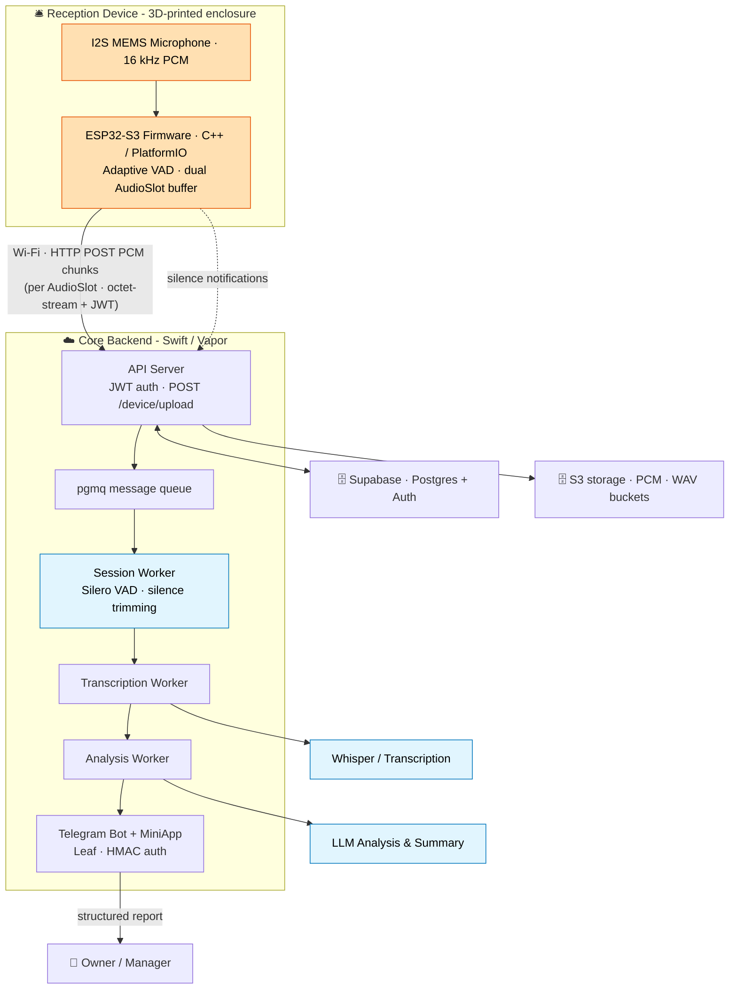

# AI Reception: Technical Architecture

> Deep-dive technical reference for the AI Reception system.
> For the high-level overview, screenshots, and build instructions, see the
> [root README](../README.md). For the product narrative, see the
> [case study](case-study.md).

This document describes the end-to-end system: how a passive ESP32-S3 desk
device captures front-desk conversations, how those conversations travel through
the Swift/Vapor cloud backend, and how the owner receives a structured report on
Telegram. Everything below is derived directly from the firmware and backend
source. Where a value or behavior is named, it is taken from the code, not
assumed.

---

## 1. System overview

AI Reception is a three-part product:

| Layer | Runtime | Responsibility |
|---|---|---|
| **Device (edge)** | ESP32-S3 · C++ / PlatformIO + Arduino | Capture mic audio, run on-device VAD, upload speech as discrete PCM chunks over HTTP |
| **Core (cloud)** | Swift 6.1 · Vapor 4 · Docker Compose | Authenticate devices, ingest PCM, sessionize, trim silence, transcribe, analyze, deliver |
| **Storage / AI** | Supabase Postgres + PGMQ · S3 buckets · OpenAI cloud · Silero VAD service | Persistence, queueing, transcription, and LLM analysis |

The defining design property: **the device does not stream audio.** It records
fixed-length 60-second PCM buffers (`AudioSlot`s) and uploads each one as a
separate, self-contained HTTP `POST`. The backend reassembles those chunks into
conversation sessions server-side.

---

## 2. Architecture diagram

The following Mermaid diagram is reproduced verbatim from the [root README](../README.md):

---

## 3. End-to-end data flow

### 3.1 Device capture

- The firmware boots, provisions Wi-Fi via a captive portal (`WiFiManager`,
  AP SSID `Ai-Reception-<DEVICE_ID>`), then calls `boot_auth()` to obtain a JWT and the
  server's wall-clock time, which it writes into the system clock with
  `settimeofday()` (`boot/boot_auth.cpp`). Accurate time is essential because
  every chunk is keyed by its capture timestamp.
- Audio runs on two FreeRTOS tasks pinned to separate cores
  (`audio/audio_system.cpp`):
  - **Capture task** (core 0, priority 5) - fills the `record_slot`.
  - **Upload task** (core 1, priority 3) - drains the `upload_slot`.
- The I2S MEMS microphone is read at **16 kHz, 32-bit slots, left channel only**
  (`i2s/i2s_mic.cpp`, `I2S_CHANNEL_FMT_ONLY_LEFT`). Each raw 32-bit sample is
  DC-blocked with a one-pole high-pass (`alpha_ = 0.995`), right-shifted by 11
  (`>> 11`, an effective volume boost), clamped to int16 range, and stored as
  **16-bit PCM**. So the wire format is 16-bit even though the I2S slot width is
  32-bit.

### 3.2 Adaptive VAD (on-device)

- `AdaptiveVAD` (`audio/adaptive_vad.h` / `.cpp`) decides speech vs. silence per
  frame using **energy** and **zero-crossing rate (ZCR)** features against a
  continuously-adapted background model.
- Key parameters (from `adaptive_vad.h`): `CALIBRATION_SAMPLES = 500`,
  `BACKGROUND_HISTORY = 1000`, `CHANGE_THRESHOLD = 3.0` sigma,
  `ZCR_MIN = 0.03` / `ZCR_MAX = 0.4`, `MIN_SPEECH_FRAMES = 3`, and an hourly
  recalibration (`RECALIB_INTERVAL = 3600000 ms`). State machine:
  `VAD_CALIBRATING → VAD_RUNNING → VAD_RECALIBRATING`.
- VAD runs **while** the slot is filling. As soon as any frame in a slot is
  classified as speech, the whole 60-second slot is flagged
  `has_speech = true`. The VAD here is a coarse on-device gate; precise
  trimming happens server-side with Silero.

### 3.3 AudioSlot (dual-buffer, chunked)

- Two slots are allocated in **PSRAM** (`init_audio_memory()`), each sized
  `I2S_SAMPLE_RATE * AUDIO_RECORD_DURATION_SEC * sizeof(int16_t)` =
  `16000 * 60 * 2` = **1,920,000 bytes (~1.83 MB)** holding 960,000 samples.
- The capture task records exactly 60 s into `record_slot`, then copies it into
  `upload_slot` and marks it ready (`used = false`). A timing compensation keeps
  the cycle on a fixed `RECORD_INTERVAL_MS = 60000` ms cadence.
- The upload task branches on `has_speech`:
  - **Speech** → `upload_audio_slot()` (`POST /device/upload/...`), up to 5
    retries; on total failure it reboots (`ESP.restart()`).
  - **Silence** → `upload_silence_notification()` (`POST /device/silence/...`),
    up to 3 retries; on total failure it reboots.

> Note on retry counts: `platformio.ini` defines `MAX_UPLOAD_RETRIES=3` /
> `UPLOAD_RETRY_DELAY_MS=5000`, but the audio upload loop in
> `audio_system.cpp` is hard-coded to **5 attempts with a 3 s delay** (silence:
> 3 attempts / 2 s). The hard-coded values are what actually run.

### 3.4 HTTP POST PCM chunk → API

Each speech slot is sent as one `POST /device/upload/{DEVICE_ID}` with
`Content-Type: application/octet-stream`, `Authorization: Bearer <JWT>`, and the
`X-Timestamp` / `X-Sample-Rate` / `X-Sample-Count` headers
(`server/server_api.cpp`). The body is the raw little-endian int16 PCM.

The Vapor `DeviceController.upload` (`APIServer/Controllers/DeviceController.swift`):

1. Verifies the JWT and that `payload.device_id == :deviceid`.
2. Reads `X-Timestamp` and streams the request body into a `Data` buffer.
3. **Validates size**: must equal
   `sampleRate * channels * (bitsPerSample/8) * duration` =
   `16000 * 1 * 2 * 60` = **1,920,000 bytes** (`Shared/Utils/AudioConfig.swift`).
   Wrong size → `400`.
4. **Runs Silero VAD first** (see 3.5). If the returned 60-element mask contains
   no `1`, the chunk is treated as silence: a `SilenceChunk` is upserted, the
   device's `bad_vad_count` is incremented, and the audio is **not** stored.
5. If speech is present, the PCM is uploaded to S3 under
   `{deviceId}/{unixTimestamp}.pcm` (bucket `S3_DEVICE_PCM_BUCKET`), and a
   `pcm_chunks` row is upserted (on conflict `s3_key`) carrying the full
   `vad_timeline` array.

### 3.5 Server-side Silero VAD gate (in the API request)

`SileroVADService` (`APIServer/Utils/SileroVADService.swift`) converts the PCM
to an `Int` array and `POST`s it to the Python Silero service (`SILERO_VAD_URL`,
`/vad`). The service (`silero-vad/main.py`, FastAPI + `snakers4/silero-vad`)
expects exactly 960,000 samples, normalizes to `[-1, 1]`, runs
`get_speech_timestamps` (`threshold=0.5`, `min_speech_duration_ms=250`,
`min_silence_duration_ms=100`, `window_size_samples=1024`, `speech_pad_ms=30`),
and returns a **60-element binary mask, one entry per second**. If the Silero
call is non-200, the Swift side falls back to a 60-zero mask (treated as
silence). This is a second, more accurate gate that runs *before* anything is
persisted, saving storage and downstream compute on the device's coarse VAD
false-positives.

### 3.6 pgmq → SessionWorker → TranscriptionWorker → AnalysisWorker

Stages hand off through **PGMQ** (Postgres-backed queue) using
`pgmqGet`/`pgmqAck` RPCs against schema `pgmq_public` (`Shared/Supabase/Pgmq.swift`).
Three queues: **`session-queue`**, **`transcription-queue`**, **`analysis-queue`**.

- **SessionWorker** (`Sources/SessionWorker`): groups contiguous `pcm_chunks`
  into conversation **sessions**, uses Silero VAD timelines to trim silence, and
  produces a clean session WAV (stored in `S3_SESSIONS_WAV_BUCKET`). Supporting
  logic lives in `src/ProcessTimeline.swift`, `SessionTimelines.swift`,
  `TimelineExtensions.swift`, `BeautifySession.swift`.
- **TranscriptionWorker** (`Sources/TranscriptionWorker`): sends the session
  WAV to **OpenAI Whisper** (`Shared/OpenAI/WhisperService.swift`) for
  speech-to-text.
- **AnalysisWorker** (`Sources/AnalysisWorker`): runs an **OpenAI LLM** over the
  transcript (`Shared/OpenAI/OpenAIClient.swift`, `PromptService.swift`,
  stored prompt IDs in `PromptIDs.swift`) to produce a structured summary /
  analysis (`vad_analysis`).

### 3.7 Delivery (Telegram)

The **MiniApp** (`Sources/MiniApp`) is a Vapor + **Leaf** app serving a Telegram
Mini App and bot. It verifies Telegram `initData` via **HMAC**
(`MiniApp/Middleware/TelegramAuthMiddleware.swift`) and renders session reports
(summary, quality score, keywords, transcript) from Leaf templates in
`workers/Resources/Views/`. The owner opens the Telegram Mini App to review the
structured report of each conversation.

---

## 4. Device HTTP API

Base URL is the build-time `SERVER_URL`; device id is the build-time `DEVICE_ID`.
All routes are registered in `DeviceController.boot(routes:)`. `boot` is
unauthenticated and issues the JWT; the other three require
`Authorization: Bearer <JWT>` and enforce that the token's `device_id` matches
the `:deviceid` path parameter.

### `GET /device/boot/{deviceid}`

- **Auth:** none (this is where the JWT is issued).
- **Behavior:** looks up the device in Supabase, signs a `DevicePayload` JWT,
  sets `boot_at` / `last_active_at` (and `activated_at` on first boot).
- **Response:** `{"jwt": "<token>", "time": <unix_seconds>}`. The firmware uses
  `time` to set its clock.

### `POST /device/upload/{deviceid}`

- **Headers:** `Content-Type: application/octet-stream`,
  `Authorization: Bearer <JWT>`, `X-Timestamp` (unix seconds, slot capture
  time), `X-Sample-Rate` (`16000`), `X-Sample-Count` (`960000`).
- **Body:** raw little-endian int16 PCM, exactly **1,920,000 bytes**.
- **Behavior:** JWT + device check → size/format validation → Silero VAD gate →
  S3 upload + `pcm_chunks` insert (speech) or `silence_chunks` insert +
  `bad_vad_count++` (no speech).
- **Response:** `200 OK` (`"OK"` or `"OK - No voice activity detected"`); `400`
  on bad size/format; `401`/`403` on auth failure.

### `POST /device/silence/{deviceid}`

- **Headers:** `Content-Type: application/json`,
  `Authorization: Bearer <JWT>`, `X-Timestamp`.
- **Body:** empty (the firmware sends `""`).
- **Behavior:** upserts a `silence_chunks` row (on conflict `device_id,timestamp`)
  and bumps `last_active_at`. This is the device telling the server "this
  60-second slot had no speech, no audio uploaded."
- **Response:** `200 OK`.

### `POST /device/log/{deviceid}`

- **Headers:** `Content-Type: application/json`, `Authorization: Bearer <JWT>`.
- **Body:** `{"level": "<error|warn|info|...>", "message": "<text>"}`.
- **Behavior:** inserts an `AppLog` row with `source = deviceId`. The firmware
  uses this on the next boot after a crash (`check_and_send_crash_log()` detects
  `ESP_RST_PANIC` / `ESP_RST_WDT` / `ESP_RST_BROWNOUT`).
- **Response:** `200 OK`.

---

## 5. Data model & storage

### 5.1 Supabase Postgres

Tables (from `core/supabase/migrations/`):

| Table | Purpose |
|---|---|
| `devices` | Device registry: `id`, `boot_at`, `last_active_at`, `activated_at`, `bad_vad_count`, `incomplete_timestamp` |
| `pcm_chunks` | One row per stored speech slot: `s3_key`, `timestamp`, `duration`, `device_id`, `vad_timeline` |
| `silence_chunks` | One row per silent slot (unique on `device_id,timestamp`) |
| `vad_sessions` | Reassembled conversation sessions |
| `vad_transcriptions` | Whisper transcripts per session |
| `vad_analysis` | LLM summary / structured analysis per session |
| `telegram_accounts`, `telegram_account_devices` | Owner ↔ device mapping for the Mini App |
| `logs` | Device and service logs |
| `proxies` | Outbound proxy config |

PGMQ lives inside the same Postgres instance (schema `pgmq_public`), providing
the `session-queue`, `transcription-queue`, and `analysis-queue`.

### 5.2 S3 object storage

| Bucket env | Contents | Key pattern |
|---|---|---|
| `S3_DEVICE_PCM_BUCKET` (`device-pcm`) | Raw per-slot int16 PCM uploaded from devices | `{deviceId}/{unixTimestamp}.pcm` |
| `S3_SESSIONS_WAV_BUCKET` (`sessions-wav`) | Cleaned, silence-trimmed session WAVs produced by SessionWorker | session-keyed |
| `S3_INCOMPLETE_TIMELINE_BUCKET` | Partial/in-progress timelines | - |

Access is via Soto S3 (`Shared/Utils/S3Wrapper.swift`).

---

## 6. Key design decisions

### Chunked HTTP upload vs. continuous streaming

The device deliberately **uploads discrete 60-second PCM chunks** instead of
holding an open audio stream. Reasons evident in the code:

- **Resilience over a flaky desk Wi-Fi link.** Each `AudioSlot` is a complete,
  independently-retryable unit (5 retries for audio, 3 for silence). A dropped
  connection costs at most one chunk, not the whole conversation; the firmware
  reboots cleanly if a chunk can't be delivered.
- **Simple, stateless ingestion.** The API server handles each POST in
  isolation (validate → VAD → store → enqueue) with no long-lived socket or
  backpressure to manage. Sessionization is deferred to an offline worker.
- **Cheap silence.** Slots with no speech are reported with an empty-body
  `/device/silence` call (or rejected by the server VAD) and never touch S3,
  far less traffic than streaming continuous audio.
- **Bounded device memory.** Two PSRAM slots (record + upload) are enough; the
  device never needs to buffer an entire conversation.

Trade-off: up to ~60 s of latency before a chunk is even sent, and
conversations are reconstructed from fixed slot boundaries rather than natural
speech turns, which is exactly what SessionWorker's timeline logic exists to
smooth out.

### On-device VAD vs. server VAD (both, in sequence)

The system runs VAD **twice**, on purpose:

- **On-device adaptive VAD** is a cheap, coarse gate. Its only job is to avoid
  uploading obviously-silent slots, saving uplink bandwidth and server compute.
  It runs on energy + ZCR with a self-calibrating noise floor so it adapts to
  each room without tuning.
- **Server-side Silero VAD** is the accurate gate and the trimming engine. It
  produces a per-second speech mask used both to reject false-positive uploads
  *before* persistence and to trim silence when building session WAVs.

Putting the precise model in the cloud keeps the firmware small and
power-friendly, while the on-device gate keeps the cloud from paying for the
device's silence. The `bad_vad_count` on each device records how often the
device's coarse VAD disagreed with Silero, a built-in quality signal for the
on-device threshold.

---

## 7. Cross-references

- [Root README](../README.md): overview, diagram source, build & run.
- [`firmware/README.md`](../firmware/README.md): device firmware, pin map, build flags.
- [`core/README.md`](../core/README.md): backend components, endpoints, storage.
- [`hardware/README.md`](../hardware/README.md): enclosure, print settings.
- [`hardware/BOM.md`](../hardware/BOM.md): bill of materials (reference).
- [Case study](case-study.md): product narrative and walkthrough.
