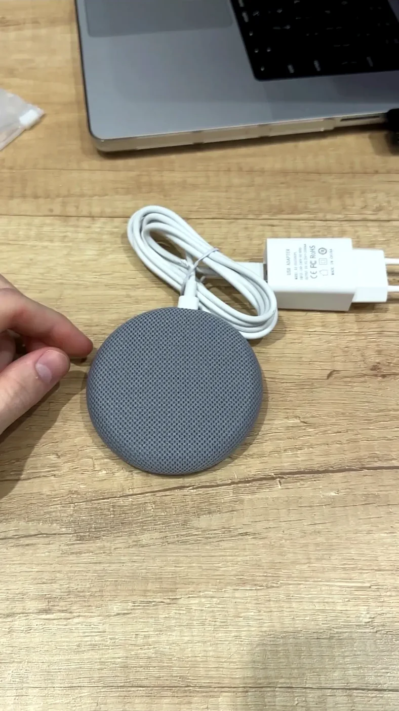
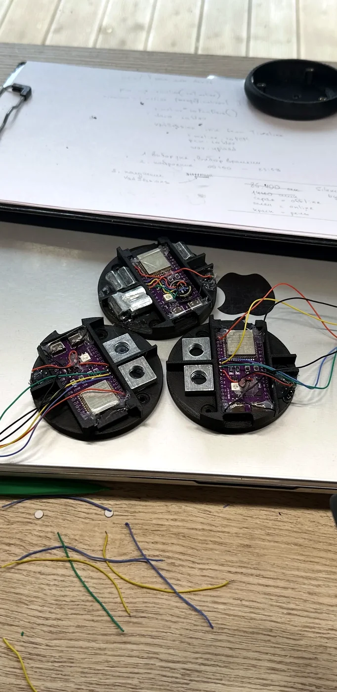
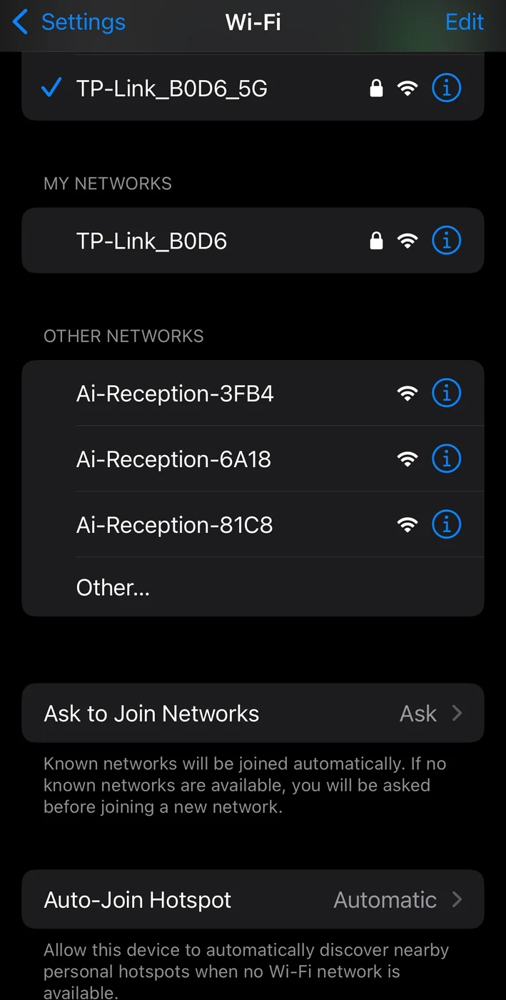
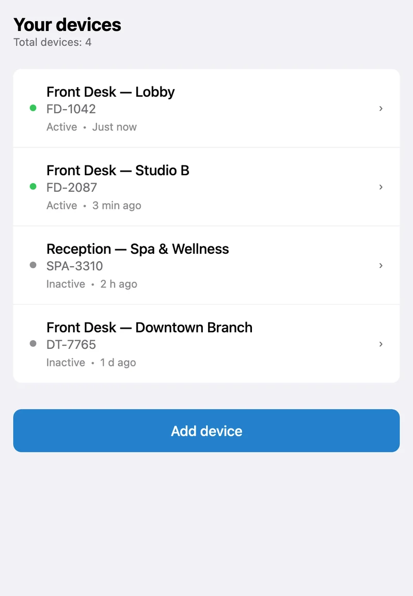
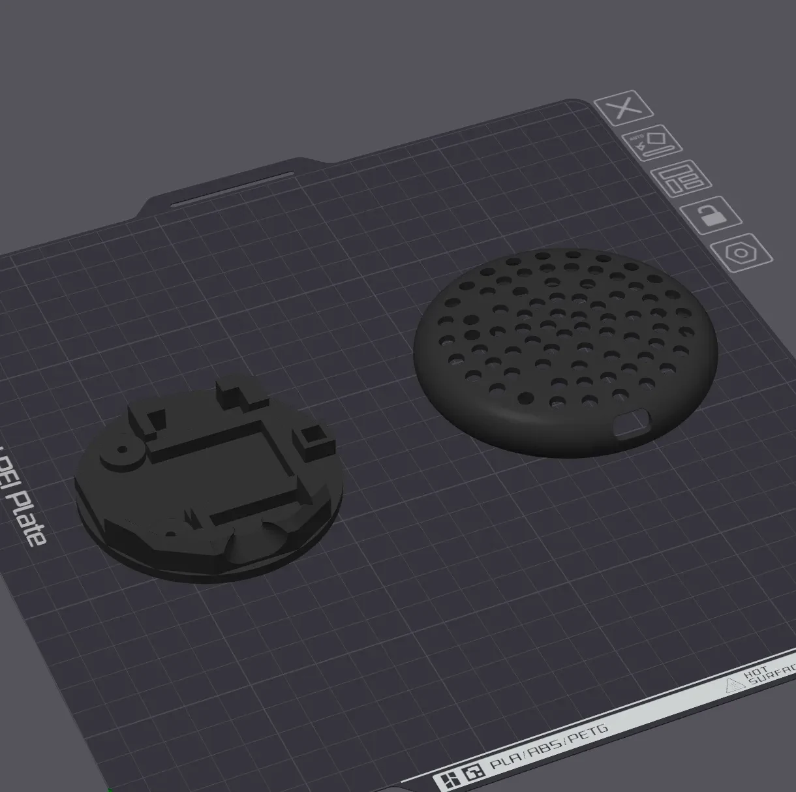

# AI Reception: A Passive Conversation-Intelligence Appliance for Small Business

A small, always-on device sits on a reception desk and passively records every customer
conversation. The audio is automatically transcribed and analyzed by AI, and the business
owner opens a Telegram mini-app to review a structured report of each conversation, no staff
involvement, no manual review.

It is a full vertical slice of product engineering: custom **ESP32-S3 firmware** (C++ /
PlatformIO) with on-device voice activity detection, a **Swift / Vapor** backend built as a
queue-driven pipeline, **OpenAI Whisper + LLM** in the cloud for transcription and analysis,
a **Telegram Bot + MiniApp** for management and delivery, and **3D-printed enclosures** for
the physical device.



---

## The problem

The owner of a small business (a clinic, a salon, a fitness club, a service shop) is rarely
standing at the front desk. As a result they have no visibility into what actually happens
there:

- what was discussed with each customer
- why a customer left without booking
- which questions come up most often
- how staff actually talk to people

Hiring someone to listen to recordings is expensive. Listening personally is impossible at
scale. **AI Reception does it automatically**: it listens, transcribes, extracts the essence,
and turns it into a concise summary the owner can read in seconds.

---

## Solution at a glance

1. A device on the desk captures audio and runs **voice activity detection on-chip**, so only
   speech leaves the device.
2. Speech is uploaded as **discrete PCM chunks over HTTP** to the backend.
3. A chain of independent **Swift workers** trims silence, transcribes with **Whisper**, and
   analyzes the transcript with an **OpenAI LLM**.
4. The result (who the customer was, why they came, what they asked, the outcome) is
   available to the owner as a structured report in the **Telegram MiniApp**.


---

## System architecture

```
┌──────────────────────────── DEVICE (ESP32-S3, C++/PlatformIO) ────────────────────────────┐
│  I2S MEMS mic @16 kHz → DMA → Adaptive VAD (on-chip) → fixed-length AudioSlot PCM buffers   │
│                                          │                                                  │
│            speech chunks: HTTP POST /device/upload/{device_id}  (octet-stream + JWT)        │
│            silence events: HTTP POST /device/silence                                        │
└──────────────────────────────────────────┼────────────────────────────────────────────────┘
                                            │
                              ┌─────────────▼─────────────┐
                              │  CORE - Swift / Vapor      │
                              │  APIServer                 │
                              │  • verify JWT              │
                              │  • store PCM → S3 bucket    │
                              │  • write chunk metadata     │
                              │  • detect session boundary  │
                              └─────────────┬─────────────┘
                                            │  enqueue (Supabase pgmq)
                                            ▼
                              ┌───────────────────────────┐
                              │  SessionWorker             │
                              │  • gather session PCM       │
                              │  • Silero VAD silence trim  │
                              │  • assemble WAV → S3 bucket │
                              └─────────────┬─────────────┘
                                            ▼  transcription queue
                              ┌───────────────────────────┐
                              │  TranscriptionWorker       │
                              │  • OpenAI Whisper (cloud)   │
                              └─────────────┬─────────────┘
                                            ▼  analysis queue
                              ┌───────────────────────────┐
                              │  AnalysisWorker            │
                              │  • OpenAI LLM (cloud)       │
                              │  • structured JSON report   │
                              └─────────────┬─────────────┘
                                            ▼
                              ┌───────────────────────────┐
                              │  Telegram Bot + MiniApp    │
                              │  structured session report │
                              └───────────────────────────┘

Storage: Supabase (Postgres + Auth) · S3-compatible buckets (raw PCM, assembled WAV)
Queue:   Supabase pgmq (Postgres message queue) - no Redis, no Kafka
```

The pipeline is deliberately decomposed into small, independent processes connected by a
**Postgres-native message queue (pgmq)**. Each worker reads one message, does one job, and
publishes the next message. A crash in any single worker does not bring down the system - the
message simply stays on its queue and is retried.

---

## The device: ESP32-S3 firmware (C++ / PlatformIO)

The current device is built on the **ESP32-S3** (Xtensa LX7, 8 MB PSRAM, native USB) using
**PlatformIO** for a comfortable, library-rich workflow. A digital **I2S MEMS microphone**
feeds the chip directly.



### I2S audio capture

Capture parameters are tuned for intelligible speech at minimal bandwidth:

- **16 kHz sample rate**, the practical minimum for clear speech through Whisper
- **16-bit PCM, mono**, the standard input for speech-to-text
- **DMA double buffering**, I2S reads into a ring buffer via DMA, so the CPU never blocks
  waiting on samples

### Adaptive VAD: speech detection on-chip

A custom C++ voice-activity detector runs on every buffer *before* anything is uploaded. It
combines two cheap, real-time features:

```cpp
class AdaptiveVAD {
  float energyThreshold;  // dynamic RMS threshold
  float zcrThreshold;     // dynamic zero-crossing threshold

  float computeRMS(int16_t* samples, size_t n) {
    float sum = 0;
    for (size_t i = 0; i < n; i++)
      sum += (float)samples[i] * samples[i];
    return sqrtf(sum / n);
  }

  float computeZCR(int16_t* samples, size_t n) {
    int crossings = 0;
    for (size_t i = 1; i < n; i++)
      if ((samples[i] >= 0) != (samples[i-1] >= 0)) crossings++;
    return (float)crossings / n;
  }

public:
  bool detect(int16_t* samples, size_t count) {
    return computeRMS(samples, count) > energyThreshold
        && computeZCR(samples, count) < zcrThreshold;
  }
};
```

_Simplified for illustration._

- **Energy (RMS)**: speech has high amplitude; background noise and silence are low. This is
  the primary detector.
- **Zero-Crossing Rate (ZCR)**: hiss, white noise and fans produce frequent zero crossings
  (high ZCR), whereas the voice is a slow, harmonic oscillation (low ZCR). ZCR filters out
  high-frequency interference that RMS alone would let through.

**Self-calibration on boot:** at power-on the device samples 2-3 seconds of ambient noise. The
mean background RMS × 1.8 becomes `energyThreshold`; the mean background ZCR × 1.3 becomes
`zcrThreshold`. A room with an air conditioner running and a quiet room get different
thresholds automatically.

The result: only buffers classified as speech are uploaded. Bandwidth and storage drop by
roughly **3-5×** compared with uploading everything.

### AudioSlot: fixed-length ping-pong buffers in PSRAM

While one chunk is being uploaded over HTTP, I2S capture must not pause. The firmware uses two
fixed-length **AudioSlot** buffers in PSRAM in a ping-pong arrangement:

```
Slot A: [== RECORDING ==] → [== UPLOADING ==] → [== RECORDING ==] → ...
Slot B:                     [== RECORDING ==] → [== UPLOADING ==] → ...
```

Each slot is a fixed PCM buffer plus a state flag (`FREE / RECORDING / READY / UPLOADING`). One
core fills the active slot; when it is full the slot is marked `READY` and capture switches to
the other slot. The second core sees `READY`, performs the HTTP upload, and marks the slot
`FREE` on success. No write blocking, no audio dropped during network latency.

### Dual-core scheduling (FreeRTOS)

| Core   | Task          | Responsibility                                            |
|--------|---------------|-----------------------------------------------------------|
| Core 0 | `captureTask` | I2S DMA read → Adaptive VAD → fill AudioSlot               |
| Core 1 | `uploadTask`  | drain READY AudioSlot → HTTP POST with JWT header          |

Synchronization is a single counting semaphore: Core 0 calls `xSemaphoreGive` when a slot is
ready; Core 1 blocks on `xSemaphoreTake`. The Wi-Fi stack lives on Core 1, so networking never
interferes with capture.

### Upload protocol

The device **does not stream** audio. It uploads discrete, fixed-length PCM chunks:

- **Speech:** `POST /device/upload/{device_id}` with the raw PCM as
  `application/octet-stream` and a JWT in the `Authorization: Bearer ...` header.
- **Silence:** when the on-chip VAD detects a sustained pause, the device sends a lightweight
  notification to `POST /device/silence`. The backend uses these silence events together with
  the chunk stream to determine where one conversation ends and the next begins.

### Provisioning

**Captive portal (WiFiManager):** on first boot or after a reset the device raises a Wi-Fi
access point named `Ai-Reception-<DEVICE_ID>`. The installer connects from a phone, a captive portal
opens, they enter the venue's SSID and password, and the credentials are saved to NVS.



**JWT provisioning:** the device's token is generated in the Telegram MiniApp when a new device
is added, and entered into the device (via the captive portal "Device Token" field). Every
upload is authenticated with that token.

---

## The backend: Swift / Vapor "core"

The backend is a set of small, independent Swift processes. The HTTP-facing **APIServer** is a
Vapor application; each downstream stage is its own worker draining a pgmq queue.

### APIServer: chunk ingestion

For each incoming chunk the APIServer:

1. Verifies the JWT from `Authorization: Bearer ...`.
2. Resolves the device and updates `last_seen_at`.
3. Stores the raw PCM into the **S3 PCM bucket** and writes a chunk-metadata row
   (session, chunk index, speech flag, object key) to Postgres.
4. Watches the chunk + silence-event stream and, when a conversation has clearly ended,
   publishes the session id to the **session queue**.

Session boundaries are decided server-side: the device just reports speech chunks and silence
events; the server recognizes the end-of-conversation pattern.

### SessionWorker: silence trimming and WAV assembly

The SessionWorker consumes a `session_id`, gathers that session's PCM chunks from S3, and
builds a single clean WAV:

- **Silero VAD silence-trimming.** A machine-learning VAD (Silero) runs over the gathered audio
  to remove residual non-speech that the lightweight on-chip Adaptive VAD let through. Short
  internal pauses (natural gaps within a single utterance) are preserved; long gaps become
  region boundaries.
- **WAV assembly.** The retained speech regions are concatenated into one 16 kHz / 16-bit / mono
  WAV and written to the **S3 WAV bucket**.

```swift
func buildWAV(regions: [SpeechRegion]) -> Data {
  let pcm = regions.flatMap { $0.samples }
  let header = WAVHeader(sampleRate: 16000, bitsPerSample: 16, channels: 1, dataSize: pcm.count)
  return header.bytes + Data(pcm)
}
```

_Simplified for illustration._

The two-stage VAD design is intentional: the on-chip Adaptive VAD is a cheap real-time
heuristic that discards ~90% of non-speech for free; Silero is a heavier but far more accurate
ML model that does the final cleanup before the *expensive* transcription call. The session id
is then published to the **transcription queue**.

### TranscriptionWorker: OpenAI Whisper (cloud)

The TranscriptionWorker downloads the cleaned WAV from S3 and sends it to **OpenAI Whisper**
(cloud). The transcript is stored on the session, and the id is published to the **analysis
queue**.

### AnalysisWorker: OpenAI LLM (cloud)

The AnalysisWorker sends the transcript to an **OpenAI LLM** with a structured-output prompt
and stores the returned JSON on the session:

```
System:
You are an analyst of front-desk conversations.
Respond strictly as JSON, with no markdown.

User:
Conversation transcript:
"{transcript}"

Return JSON:
{
  "client_name":    "name if mentioned, otherwise null",
  "visit_purpose":  "purpose of the visit in one phrase",
  "key_questions":  ["question 1", "question 2"],
  "outcome":        "booked | declined | will_call_back | other",
  "sentiment":      "positive | neutral | negative",
  "action_required":"what the owner should do"
}
```

Using the model's JSON / structured-output mode makes parsing reliable. The result is stored as
JSONB and the session is marked `analyzed`, ready to review in the Telegram MiniApp.

---

## Telegram Bot + MiniApp

The owner-facing surface is a Telegram Bot with an embedded **MiniApp** (Vapor + Leaf
templates). It is where reports are delivered and devices are managed.

### Authentication

Every MiniApp request is verified against Telegram's WebApp `initData` using **HMAC-SHA256**, the standard Telegram WebApp scheme, so requests cannot be forged:

```swift
struct TelegramAuthMiddleware: AsyncMiddleware {
  func respond(to request: Request, chainingTo next: AsyncResponder) async throws -> Response {
    guard let initData = request.headers["X-Telegram-Init-Data"].first else {
      throw Abort(.unauthorized)
    }
    let params = initData.split(separator: "&")
    let receivedHash = params.first { $0.hasPrefix("hash=") }?
      .dropFirst("hash=".count).description ?? ""
    let secretKey = HMAC<SHA256>.authenticationCode(
      for: Data("WebAppData".utf8),
      using: SymmetricKey(data: Data(botToken.utf8))
    )
    let dataCheckString = params
      .filter { !$0.hasPrefix("hash=") }
      .sorted()
      .joined(separator: "\n")
    let computed = HMAC<SHA256>.authenticationCode(
      for: Data(dataCheckString.utf8),
      using: SymmetricKey(data: secretKey)
    )
    guard computed == receivedHash else { throw Abort(.unauthorized) }
    return try await next.respond(to: request)
  }
}
```

_Simplified for illustration._

### Screens

**Devices**: a list of the owner's devices with online/offline status (derived from
`last_seen_at`) and a flow to add a new device, which generates the JWT provisioning code.



**Sessions**: a chronological feed of conversations. Each card shows the time and duration, the
customer name (from the AI analysis), the visit purpose, the outcome, extracted keyword chips,
and quick access to the audio and the full transcript.


**Session report**: opening a session in the MiniApp shows its structured report, such as:

```
🏢 AI Reception - Front Desk
⏰ 14:32  •  3 min 21 sec

👤 Customer: Anna
🎯 Purpose: booking a haircut
✅ Outcome: booked for Friday

❓ Asked about:
  • coloring price
  • discounts for regulars

📋 Action: confirm coloring prices with the stylist
```

_Illustration of the mini-app session report view._ Each session in the feed opens its own
detailed report like this.

Beyond the summary, every report carries the full, timestamped transcript: toggle between the
AI-cleaned text and the raw dialogue:


---

## Data & storage

- **Supabase (Postgres + Auth)** holds the relational data: devices, sessions, and per-chunk
  metadata.
- **S3-compatible buckets** hold the binary audio: one bucket for the raw uploaded **PCM**
  chunks, one for the assembled **WAV** files. Postgres stores only the object keys, keeping
  rows small.
- **Supabase pgmq** provides the three work queues (`session`, `transcription`, `analysis`)
  using nothing but Postgres.

A simplified shape of the core tables:

```sql
create table devices (
  id uuid primary key default gen_random_uuid(),
  owner_telegram_id bigint not null,
  name text not null,
  jwt_token text not null unique,
  last_seen_at timestamptz,
  created_at timestamptz default now()
);

create table sessions (
  id uuid primary key default gen_random_uuid(),
  device_id uuid references devices(id),
  wav_object_key text,            -- S3 WAV bucket
  duration_sec int,
  transcript text,
  analysis jsonb,                 -- structured LLM report
  status text default 'pending',  -- pending → transcribed → analyzed
  started_at timestamptz,
  ended_at timestamptz,
  created_at timestamptz default now()
);

create table chunks (
  id bigserial primary key,
  session_id uuid references sessions(id) on delete cascade,
  device_id uuid references devices(id),
  chunk_index int not null,
  is_speech bool not null,
  pcm_object_key text not null,   -- S3 PCM bucket
  recorded_at timestamptz not null
);

create index on chunks (session_id, chunk_index);
```

_Simplified for illustration; the real schema uses tables such as `pcm_chunks`, `vad_sessions`,
`vad_transcriptions`, and `vad_analysis`._

---

## Hardware & enclosure

The device lives in a **3D-printed round enclosure** designed alongside the firmware so it can
sit cleanly on a reception counter. The housing balances three constraints:
a clear acoustic path to the MEMS microphone, ventilation, and a compact, unobtrusive form
factor.

Multiple enclosure parts were modeled and printed: the base that holds the board, the
perforated grille over the microphone, and the mounting frame:



---

## Project evolution

The current ESP32-S3 system is the third iteration; earlier attempts shaped its design and are
worth a brief note:

- **Gen 1: ESP32 / ESP-IDF (C).** The first prototype wrote raw audio to an SD card and did
  voice-activity detection *server-side*. That meant the device uploaded everything (fans,
  music, silence), the SD card added latency and a data-loss risk on power cuts, and there was
  no device authentication. The clear lesson: VAD belongs on the device, and the buffer belongs
  in RAM, not on a card.
- **Raspberry Pi edge node, abandoned.** A middle attempt put a Raspberry Pi next to the
  reception to run Silero VAD locally (and, optionally, USB-camera capture). It was dropped:
  PyTorch on ARM was heavy, unstable and slow for real-time inference; it required *two* powered
  devices side by side instead of one; and the video path never worked reliably.

Both lessons converged on the current design: move VAD on-chip, eliminate the second box, and
keep only the heavy ML (Silero, Whisper, the LLM) in the backend.

---

## Outcomes

- **End-to-end working system**: a physical device, custom firmware, a queue-driven backend,
  cloud AI, and a Telegram delivery surface, all integrated.
- **Bandwidth cut 3-5×** by doing voice-activity detection on-chip instead of uploading raw
  audio.
- **Resilient by design**: independent workers on a Postgres-native queue mean a failure in one
  stage never takes down the pipeline.
- **Zero staff effort**: the owner reads a concise, structured summary in Telegram seconds after
  each conversation ends.

---

## Tech stack

| Layer        | Technology                                                        |
|--------------|-------------------------------------------------------------------|
| Device       | ESP32-S3 · C++ / PlatformIO · FreeRTOS · I2S MEMS mic · Adaptive VAD |
| Transport    | HTTP POST (octet-stream PCM chunks) · JWT auth                     |
| Backend      | Swift · Vapor (APIServer + workers) · Leaf (MiniApp templates)     |
| Queue        | Supabase pgmq (Postgres message queue)                            |
| Data / Auth  | Supabase (Postgres + Auth)                                        |
| Object store | S3-compatible buckets (PCM, WAV)                                  |
| AI           | OpenAI Whisper (transcription) · OpenAI LLM (analysis) · Silero VAD |
| Delivery     | Telegram Bot + MiniApp                                            |
| Hardware     | 3D-printed round enclosure                                       |
</content>
</invoke>
